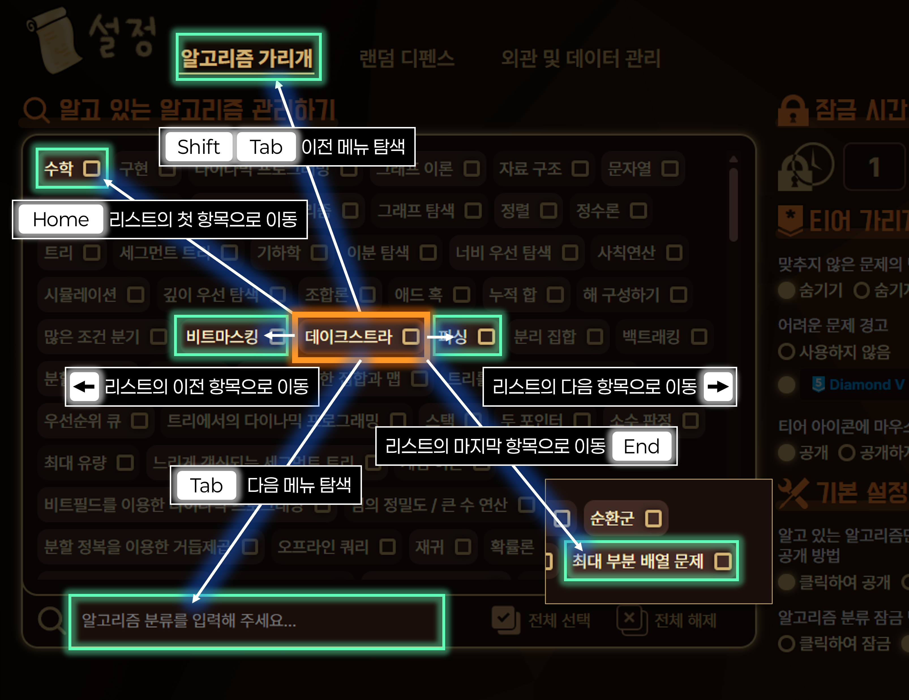

토탐정은 모든 사용자가 원활하게 기능을 사용할 수 있도록 키보드 접근성을 최우선으로 고려하고 있습니다. 대부분의 기능을 마우스 없이 키보드 탐색만으로 이용할 수 있습니다.

## 기본 탐색 방법

일반적인 웹사이트에서 탐색하는 방법과 동일합니다. 탐색 시 현재 선택되어 있는 메뉴가 강조됩니다.

- <kbd>Tab</kbd> 키를 눌러 다음 메뉴를, <kbd>Shift</kbd> + <kbd>Tab</kbd>
  키를 눌러 이전 메뉴를 선택할 수 있습니다.
- <kbd>Space</kbd> 키나 <kbd>Enter</kbd> 키를 눌러 선택된 메뉴의 기능을 실행할
  수 있습니다.

## 토탐정 위젯 이용하기

- <kbd>Alt</kbd> + <kbd>Shift</kbd> + <kbd>W</kbd>를 누르면 토탐정 위젯이 열리고
  TOP버튼이 선택됩니다. 다시 누르면 위젯이 닫히고 위젯을 열기 전 본래 탐색하던
  메뉴로 돌아갑니다.
- **랜덤 디펜스** 버튼을 선택한 후 <kbd>Space</kbd> 키나 <kbd>Enter</kbd> 키를 길게 누르면 **즉석 추첨** 기능을 이용할 수 있습니다.

## 항목이 많은 메뉴를 탐색하는 경우

**알고 있는 알고리즘 관리하기** 메뉴와 같이 항목이 많은 리스트 형태의 메뉴는 다음 메뉴로 탐색하기 위해 많은 항목을 건너뛰어야 하므로 불편할 수 있습니다. 따라서 이러한 메뉴의 경우 탐색 방법이 다릅니다.

- <kbd>Tab</kbd>, <kbd>Shift</kbd> + <kbd>Tab</kbd> 키를 통해 리스트 메뉴의 안과
  밖을 오갈 수 있습니다. 리스트의 모든 항목을 탐색할 필요 없이 건너뛸 수
  있습니다.
- <kbd>←</kbd>, <kbd>→</kbd> 키를 통해 리스트 내에서 선택되어 있는 항목의 이전
  또는 다음 항목을 선택할 수 있습니다.
- <kbd>Home</kbd>, <kbd>End</kbd> 키를 통해 각각 리스트의 첫 번째 항목, 마지막
  항목을 선택할 수 있습니다.

