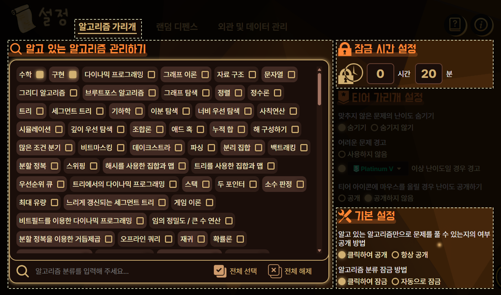

**알고리즘 가리개**는 알고리즘 분류를 공개하지 않고도, 내가 알고 있는 알고리즘들만으로 풀 수 있는 문제인지 확인하는 **문제 조사** 기능과, 알고리즘 분류를 보지 못하도록 일정 시간 동안 잠그는 **문제 잠금** 기능으로 나뉩니다.

내가 알고 있는 알고리즘만으로 구성된 문제를 풀고 싶은데, 풀 수 있는 문제인지 확인하기 위해 알고리즘 분류를 스포일러 당하기는 싫은 분들, 무분별하게 알고리즘 분류를 공개하지 않고 조금 더 고민해 볼 수 있는 환경을 원하는 분들을 위해 기획된 기능입니다.

## 설정 방법

알고리즘 가리개는 설정 페이지의 **[알고리즘 가리개]** 카테고리에서 설정하실 수 있습니다.

### 알고 있는 알고리즘 관리하기

알고 있는 알고리즘을 이곳에서 체크하실 수 있습니다. 이후 **문제 조사** 기능 사용 시, 알고 있는 알고리즘만을 이용하여 풀 수 있는 문제인지를 알려드립니다.

검색창에는 알고리즘명을 한글 또는 영문으로 입력해주시면 되며, 태그 및 일부 별명을 적으시는 경우에도 검색 결과에 표시될 수 있습니다.

### 잠금 시간 설정

**문제 잠금** 기능 사용 시 적용될 잠금 시간을 설정하실 수 있습니다. 시간은 **0분**부터 **99시간 59분**까지로 설정할 수 있습니다.

### 기본 설정

- **알고 있는 알고리즘만으로 문제를 풀 수 있는지의 여부 공개 방법**
  - **클릭하여 공개**: 문제 페이지에서 토탐정 위젯의 **문제 조사** 버튼을 눌러 여부를 알 수 있습니다. 이 때 토스트 알림이 표시됩니다.
  - **자동으로 공개**: 문제 페이지에 접속하는 즉시 문제 제목 옆에 문제를 풀 수 있는지 여부가 아이콘으로 표시됩니다.

- **알고리즘 분류 잠금 방법**
  - **클릭하여 잠금**: 문제 페이지에서 토탐정 위젯의 **문제 잠금** 버튼을 눌러 문제를 잠글 수 있습니다.
  - **자동으로 잠금**: 문제 페이지에 접속하는 즉시 해당 문제의 잠금 타이머가 시작되며 문제가 잠깁니다.

## 사용 방법

### 문제 조사

### 문제 잠금

잠금 타이머는 최대 300문제까지 저장되며, 300문제를 넘을 경우 오래된 타이머 순으로 지워집니다.

## 알고리즘 가리개가 작동하지 않는 경우

**알고리즘 가리개**는 아래의 상황에서는 **작동하지 않습니다**. 이 경우 토탐정 위젯의 **문제 조사**와 **문제 잠금** 버튼이 비활성화됩니다.

- 문제 페이지에 있지 않은 경우
- 이미 푼 문제라서 알고리즘 분류가 공개되어 있는 경우
- 아직 문제의 알고리즘 분류가 기여되지 않아 정해진 알고리즘이 없는 경우
- 이미 알고리즘 분류를 클릭해서 공개한 경우
