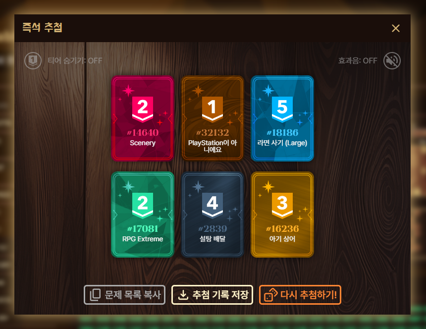

**즉석 추첨**은 여러 문제를 한꺼번에 추첨할 수 있는 기능입니다. 한 번에 한 문제씩만 추첨할 수 있었던 랜덤 디펜스 기능을 보완하기 위해 만들어졌습니다. 가챠와 같은 연출과 함께 추첨을 재밌게 진행할 수 있습니다.

## 사용 방법

사용 방법을 정리하면 아래와 같습니다. 랜덤 디펜스를 진행하기 위해 만든 추첨을 그대로 활용하실 수 있습니다. 추첨을 만드는 방법의 경우 [랜덤 디펜스](/features/random-defense) 문서를 확인해 주세요.


추첨 결과는 아래와 같이 나오며, 결과 모달 창에서 사용할 수 있는 기능들은 아래와 같습니다.



1.  **티어 숨기기**: ON일 경우 문제들의 난이도를 모두 숨깁니다. 이 설정은 창을 닫아도 유지됩니다.
2.  **효과음**: ON일 경우 추첨 중 연출을 위한 효과음을 재생합니다. 이 설정은 창을 닫아도 유지됩니다.
3.  **문제 목록 복사**: 클립보드에 추첨 제목과 추첨 결과로 나온 문제들을 마크다운 문법의 형태로 복사합니다. 아래는 문제 목록을 복사했을 때의 예시 텍스트입니다.

    ```md
    # 추첨 결과 🎲

    ## 추첨 정보 ✅

    - 추첨 이름: 내 추첨
    - 문제 수: 6

    ## 문제 목록 📜

    - 18186번 - 라면 사기 (Large) (https://acmicpc.net/problem/18186)
    - 32132번 - PlayStation이 아니에요 (https://acmicpc.net/problem/32132)
    - 16236번 - 아기 상어 (https://acmicpc.net/problem/16236)
    - 14640번 - Scenery (https://acmicpc.net/problem/14640)
    - 17081번 - RPG Extreme (https://acmicpc.net/problem/17081)
    - 2839번 - 설탕 배달 (https://acmicpc.net/problem/2839)
    ```

4.  **추첨 기록 저장**: 랜덤 디펜스 카테고리의 **추첨 기록**에 추첨한 문제들을 모두 저장합니다. 즉석 추첨의 경우 기본적으로는 추첨 기록에 문제들이 저장되지 않으므로 저장을 원하시는 경우 수동으로 추첨 기록 저장 버튼을 눌러주셔야 합니다. 또한, 랜덤 디펜스와 마찬가지로 추첨 기록에 저장될 수 있는 문제 수는 최대 300문제임에 유의해 주세요.
5.  **다시 추첨하기**: 같은 추첨의 쿼리를 이용해 재추첨을 진행합니다.
