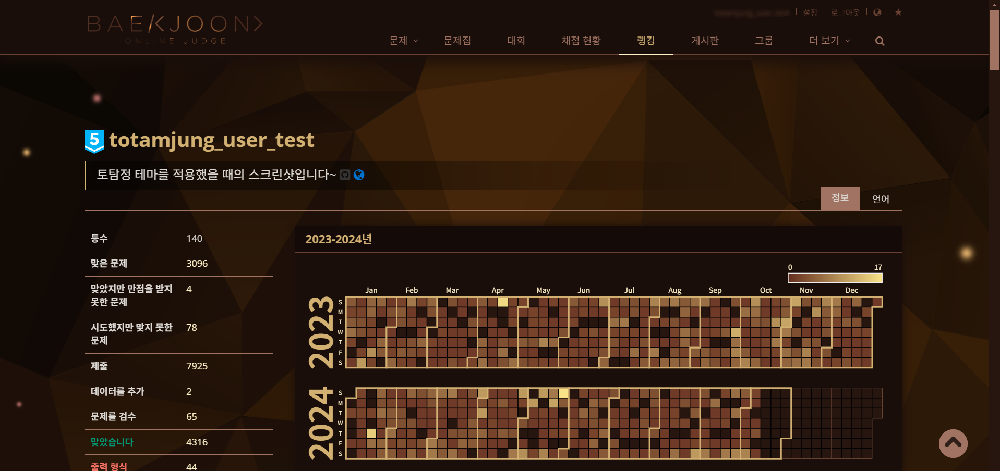
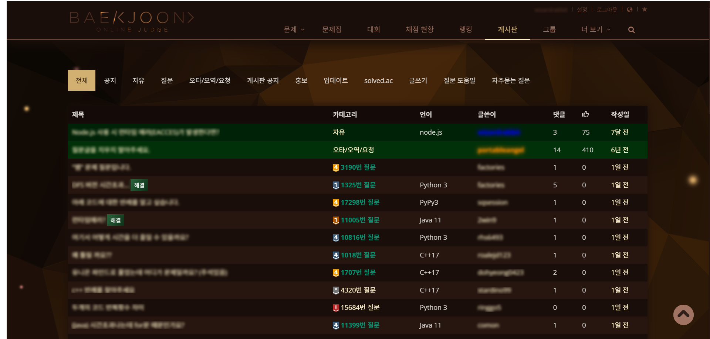
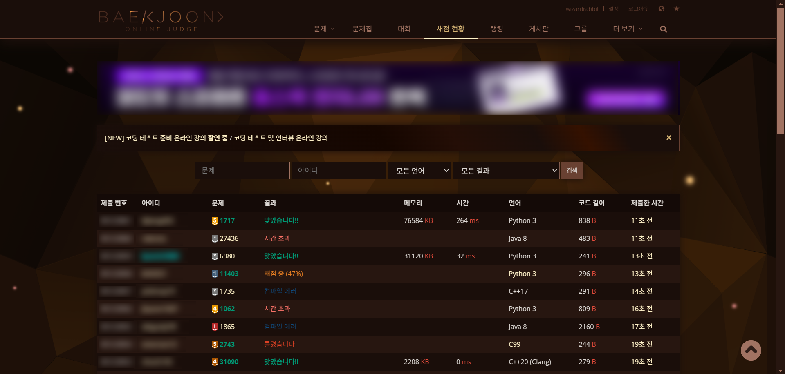
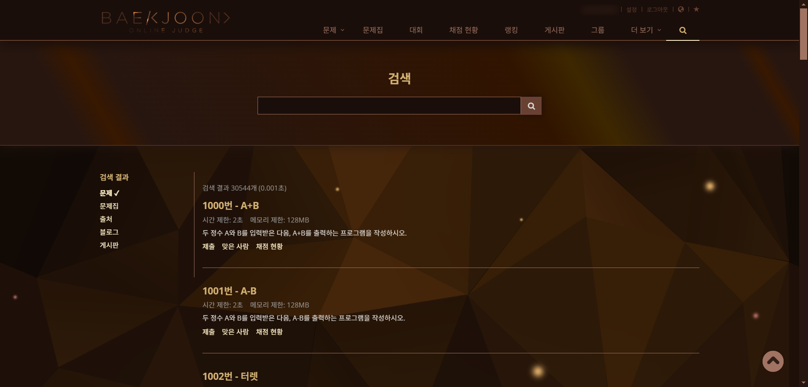
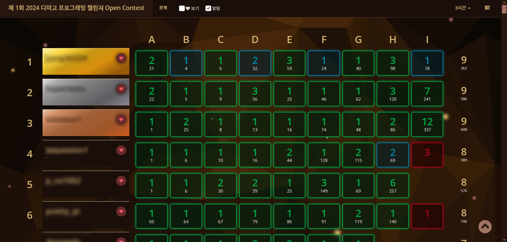
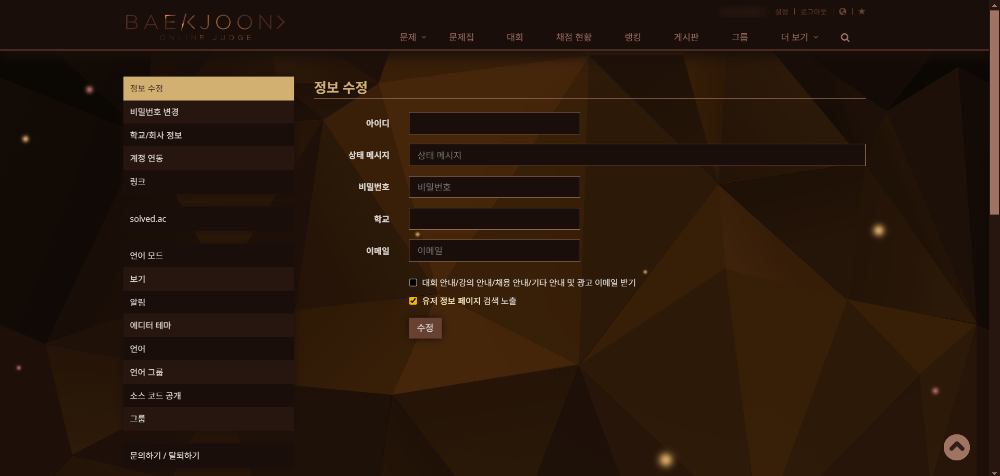
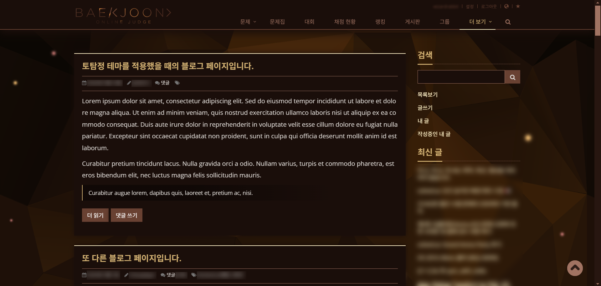
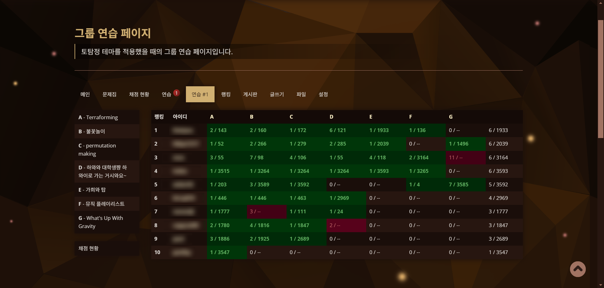

import { Image } from 'astro:assets';
import miscellaneousFontImage from '../../../assets/miscellaneous-font.png';
import miscellaneousDataManageImage from '../../../assets/miscellaneous-data-manage.png';

지금까지 다루지 않은 그 외의 기능 및 시스템들을 이 문서에서 설명합니다.

## 토탐정 테마

토탐정에서는 전용 테마를 제공합니다! 멋지고 웅장한 디자인의 토탐정 테마를 사용해 보세요. 두 가지 방법으로 테마를 활성화하실 수 있습니다.

1. 토탐정 위젯을 우클릭하고, **테마 변경** 버튼을 클릭하시는 것으로 토탐정 테마를 토글링하실 수 있습니다.
2. 설정 페이지의 **외관 및 데이터 관리** 카테고리에 있는 **테마 설정** 메뉴에서 **토탐정 테마 사용 여부**를 **사용**으로 설정해주시면 됩니다.

  
토탐정 테마를 적용한 스크린샷 보기

- 메인 페이지
  

- 사용자 프로필 페이지
  

- 게시판 페이지
  

- 문제 본문 페이지
  

- 채점 현황 페이지
  

- 검색 페이지
  

- 대회 스코어보드 페이지
  

- 설정 페이지
  

- 블로그 페이지
  

- 그룹 연습 페이지
  

- 그룹 글쓰기 페이지
  

### BOJ Extended와 같이 사용하는 경우

토탐정은 BOJ Extended 확장 프로그램의 테마에 대한 대비가 되어 있으며, 토탐정 위젯의 디자인 또한 BOJ Extended의 테마에 맞게 변경됩니다.

BOJ Extended의 테마가 활성화되어 있는 상황에서는 BOJ Extended의 테마가 우선적으로 적용되며, 토탐정의 테마는 설정과 관계없이 비활성화됩니다. 위젯에서도 테마 변경 버튼이 비활성화됩니다. 토탐정 테마를 사용하고 싶으신 경우 먼저 BOJ Extended의 테마를 **밝은 테마**로 설정해 주시면 됩니다.

## 문제 본문 폰트 설정

문제 본문의 폰트를 취향에 맞게 고르실 수 있습니다. 토탐정에서는 20여종의 폰트를 제공합니다. 문제 본문 폰트는 설정 페이지의 **외관 및 데이터 관리** 카테고리에 있는 **폰트 설정** 메뉴에서 설정하실 수 있습니다.

<Image src={miscellaneousFontImage} width="500px" height="401px" alt="" />

## 데이터 관리

토탐정에서의 혹시 모를 기능 오작동으로 인한 데이터 유실 및 재설치에 대비하고, 여러 데이터를 관리하고 공유할 수 있도록 토탐정의 설정 데이터를 세이브파일로 내보내거나 불러올 수 있습니다.

확장 프로그램을 삭제 후 재설치하거나 다른 기기에서 기존에 사용하던 데이터를 불러오실 때 활용해 주시면 됩니다. 업데이트되어 버전이 바뀌는 경우에는 토탐정에서 해당 데이터를 보존한 채 변환을 진행하므로 이를 위해 세이브파일을 다운로드하실 필요는 없습니다.

**데이터 관리**는 설정 페이지의 **외관 및 데이터 관리** 카테고리에 있는 **데이터 관리** 메뉴에서 관리하실 수 있습니다.

<Image src={miscellaneousDataManageImage} width="500px" height="401px" alt="" />

1. **설정 데이터 내보내기**: 현재 데이터를 세이브파일의 형태로 내보냅니다. 토탐정 세이브파일의 확장자는 `.ttj` 입니다.
2. **설정 데이터 업로드**: 저장해 두었던 세이브파일을 업로드하여 해당 데이터를 사용할 수 있습니다.
3. **설정 데이터 초기화**: 현재 데이터를 초기화합니다. 초기 설치 시 기본적으로 설정되는 슬롯 정보는 재생성되지 않습니다.

낮은 버전의 토탐정에서 더 높은 버전의 토탐정으로 데이터를 이전하는 경우는 가능하며 자동 마이그레이션이 진행됩니다. 하지만 그 반대는 지원하지 않으며 이로 인해 데이터 이전에 실패할 수 있습니다.

사정상 높은 버전의 토탐정 세이브파일을 낮은 버전의 토탐정 세이브파일로 변경하고 싶으신 경우에는 세이브파일과 함께 [curious.wzrabbit@gmail.com](mailto:curious.wzrabbit@gmail.com)으로 요청해 주시면 빠른 시일 내 변경을 도와드리도록 하겠습니다. 원하시는 버전도 이 때 같이 말씀해주세요.
