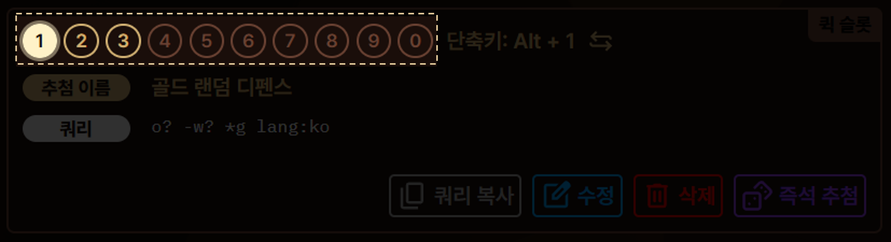
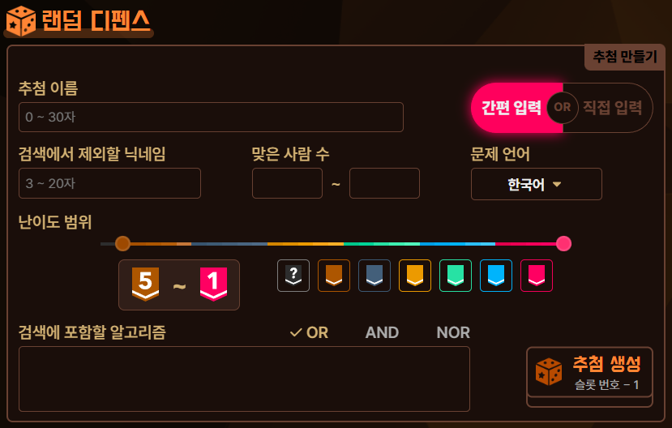
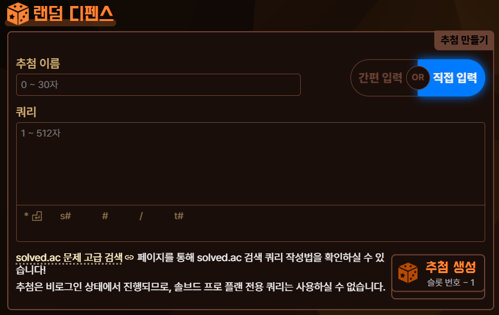
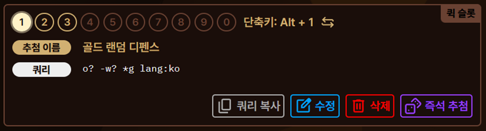

import { Image } from 'astro:assets';
import randomDefenseHistoryImage from '../../../assets/random-defense-history.png';

**랜덤 디펜스**란 특정 난이도 범위의 알고리즘 문제를 무작위로 추첨해 제한 시간 안에 해당 문제를 풀면서 연습하는 방법을 의미하는, 알고리즘 학습자들 사이에서 쓰이는 용어입니다. 토탐정과 함께라면 랜덤 디펜스를 더 편리하게 진행할 수 있습니다.

- 백준에서 단축키 단 한 번으로 빠르게 랜덤 디펜스를 시작할 수 있습니다.
- 자주 사용하는 솔브드의 검색 쿼리를 저장할 수 있는 슬롯을 최대 10개까지 사용할 수 있으며, 슬롯 번호에 대응하는 숫자와 조합한 단축키를 사용해 원하는 쿼리로 랜덤 디펜스를 자유자재로 시작할 수 있습니다.
- 솔브드의 검색 쿼리에 익숙하지 않더라도 쉽게 쿼리를 작성할 수 있습니다.

## 설정 방법

설정 방법을 설명하기에 앞서, 용어 설명을 먼저 하겠습니다.

- **추첨**이란, 랜덤 디펜스를 진행할 때 **문제를 고르는 방식이 담긴 데이터**입니다. 여러분은 랜덤 디펜스 진행을 위해 추첨을 만드실 것이며, 필요에 따라 랜덤 디펜스 진행 시 원하시는 추첨을 자유롭게 선택할 것입니다.
- **슬롯**이란, **추첨**을 **저장할 수 있는 공간**을 의미합니다.
- **쿼리**란, 솔브드의 검색 쿼리를 의미하는 것으로, **문제를 고르는 필터**를 의미합니다. 쿼리는 문자열 형태의 데이터이며, 쿼리를 통해 어떤 문제들이 랜덤 디펜스 진행 시 결정되는 문제의 후보가 될 수 있을지를 결정합니다.
  - 예를 들어 쿼리가 `lang:ko`라면 문제 언어가 한국어인 문제들을 의미하고, `tier:b..s`라면 문제의 난이도가 Bronze 또는 Silver인 문제들을 의미합니다.

랜덤 디펜스를 진행하기 위해서는 먼저 **추첨**을 만들어 **슬롯**에 저장해야 합니다. 각 **추첨**에는 **쿼리**가 들어있습니다. 이후 슬롯에 저장된 추첨을 활용하여 재설정을 할 필요 없이 바로 랜덤 디펜스를 진행하게 됩니다.

### 슬롯을 선택하는 방법

하단의 **퀵 슬롯** 메뉴에 있는 10개의 번호 중 하나를 클릭하는 것으로 슬롯을 선택할 수 있습니다.

슬롯을 선택하면 어떤 추첨이 저장되어 있는지 확인하실 수 있으며, 이후 추첨을 만들 경우 선택된 슬롯에 추첨이 만들어지게 됩니다.

### 추첨을 만드는 방법

추첨을 만드는 방법에는 **간편 입력**, **직접 입력**의 두 가지 방법이 있습니다. 상황에 따라 원하시는 방법을 선택해 주세요.

- **간편 입력**의 경우 쿼리 작성 방법을 모르는 학습자도 인터페이스를 통해 빠르고 간편하게 추첨을 만들 수 있는 방법입니다.
- **직접 입력**의 경우 쿼리를 직접 입력해 추첨을 만드는 방법입니다. 제한 없이 자유롭고 상세한 조건의 설정이 가능합니다.

두 방법 모두 **추첨 생성** 버튼을 누르면 쿼리가 담긴 추첨이 선택되어 있던 슬롯에 저장됩니다. 간편 입력 방식으로 추첨을 생성하신 경우에는 사용자님이 인터페이스에서 고르신 옵션이 쿼리로 변환되어 저장됩니다.

이미 선택된 슬롯에 추첨이 있는 경우에는 그 추첨을 **덮어쓰므로** 이 점에 유의하여 주시기 바랍니다.

#### 간편 입력

1. **추첨 이름**: 추첨의 이름을 지을 수 있습니다. 쿼리에는 영향을 주지 않습니다. 입력하지 않으셔도 상관없으며 이 경우 임의의 이름이 배정됩니다.
2. **검색에서 제외할 닉네임**: 사용자님의 계정 아이디(핸들)을 적는 곳입니다. 해당 계정으로 풀린 문제들은 추첨에서 제외됩니다.
3. **맞은 사람 수**: 맞춘 사람 수의 범위를 만족하는 문제들만 추첨되도록 설정할 수 있습니다. 맞은 사람 수를 명시하지 않는 경우 해당 문제를 맞춘 사람 수와 관련없이 문제가 추첨되며, 하한만을 제시한 경우에는 **(설정하신 하한) ~ ∞** 명이 범위로, 상한 만을 제시한 경우에는 **0 ~ (설정하신 상한)** 명이 범위로 지정됩니다.
4. **문제 언어**: 추첨되는 문제의 언어를 고르실 수 있습니다. **한국어** / **영어** / **한국어 및 영어** / **모든 언어** 중 하나를 고르실 수 있습니다.
5. **난이도 범위**: 추첨되는 문제의 난이도 범위를 고르실 수 있습니다. 슬라이더 및 버튼을 이용해 난이도 범위를 조절하실 수 있습니다.
6. **검색에 포함할 알고리즘**: 특정 알고리즘 분류들을 검색 조건에 포함시킬 수 있습니다. 알고리즘 분류는 최대 5개까지 지정할 수 있습니다. **OR** / **AND** / **NOR** 중 하나를 선택하여 어떻게 알고리즘 분류들을 검색 조건에 포함시킬 지를 선택할 수 있습니다.
   - **OR**: 지정된 알고리즘 분류 중 **적어도 하나** 포함되는 문제들만을 추첨합니다.
   - **AND**: 지정된 알고리즘 분류들을 **모두 포함하는** 문제들만을 추첨합니다.
   - **NOR**: 지정된 알고리즘 분류들을 **모두 포함하지 않는** 문제들만을 추첨합니다.

간편 입력을 통해 만들어진 추첨의 경우 연습에 부적합한 문제들이 제외되도록 쿼리가 설정됩니다.

- 난이도가 Not Ratable인 문제
- 문제해결 경고가 있는 문제
- 제출이 불가능하여 사실상 풀 수 없는 문제

Not Ratable과 문제해결 경고에 대한 설명의 경우 솔브드 도움말 페이지의 [특수한 경우의 문제 난이도](https://help.solved.ac/ko/problem/level-unusual) 문서를 참고하시기 바랍니다.

#### 직접 입력

1. **추첨 이름**: 추첨의 이름을 지을 수 있습니다. 쿼리에는 영향을 주지 않습니다. 입력하지 않으셔도 상관없으며 이 경우 임의의 이름이 배정됩니다.
2. **쿼리**: 이곳에 솔브드의 검색 쿼리를 직접 입력하실 수 있습니다. 추첨을 생성할 때 이 쿼리가 그대로 반영됩니다.
   - 자동완성을 통해 더욱 편하게 쿼리를 입력하실 수 있으며, 적용하고 싶으신 키워드가 등장했다면 [Enter] 키를 눌러 첫 번째 키워드를 적용하거나, [Tab] 키를 여러 번 눌러 적용하실 키워드를 고르신 후 [Enter] 키를 눌러 키워드를 적용하실 수 있습니다. 마우스를 클릭해 적용하는 것도 당연히 가능합니다.

솔브드의 검색 쿼리 작성법이 궁금하신 경우 솔브드의 [문제 고급 검색](https://solved.ac/search) 페이지를 참고하시기 바랍니다. 추첨은 비로그인 상태에서 진행되므로, **솔브드 프로 플랜 전용 쿼리는 입력하실 수 없음에 유의**해 주시기 바랍니다.

### 만든 추첨을 관리하는 방법

만드신 추첨은 **퀵 슬롯**에서 각 슬롯 번호를 클릭하는 것으로 추첨 정보 확인 및 관리가 가능합니다.

1. **단축키**: 추첨 시 사용할 단축키로 **Alt/Option**, **F2** 중 하나를 고르실 수 있습니다. 물론 사용하지 않는 것도 가능합니다. 단축키는 `(지정된 단축키) + (슬롯 번호)`의 형태입니다.
2. **쿼리 복사**: 쿼리를 클립보드에 복사합니다. 쿼리가 매우 길어 `...`와 같이 생략되어 있더라도 쿼리 전체가 복사됩니다.
3. **수정**: 추첨에 있는 쿼리를 직접 수정합니다. 현재로써는 인터페이스를 통해 쿼리를 수정하는 방법은 지원하지 않으며 직접 쿼리를 수정하는 것만 가능합니다.
4. **삭제**: 쿼리가 저장된 추첨을 삭제합니다.
5. **즉석 추첨**: 문제를 여러 문제씩 추첨하고 싶을 때 사용하는 토탐정의 또다른 기능입니다. [즉석 추첨](../gacha) 문서를 참고해주세요. 즉석 추첨을 통해 쿼리를 제대로 작성했는지 확인하는 용도로도 사용하실 수 있습니다.

### 추첨 기록을 관리하는 방법

우측에 있는 **추첨 기록** 메뉴에서 추첨된 문제들의 기록을 확인하고 관리하실 수 있습니다. 랜덤 디펜스가 진행되어 추첨이 진행되면 자동으로 추첨 기록에 문제가 저장됩니다.

<Image src={randomDefenseHistoryImage} width="400px" height="595px" alt="" />

추첨 기록에 저장할 수 있는 문제는 최대 300문제로, 300문제를 넘으면 오래된 기록부터 자동으로 삭제됩니다.

## 사용 방법

사용 방법은 두 가지로, 단축키를 누르는 방식과 토탐정 위젯을 클릭하는 방식이 있습니다.

1. **단축키를 누르는 방식**: 백준 사이트 내에서 **(고른 단축키 + 원하는 추첨의 슬롯 번호)** 를 눌러 랜덤 디펜스를 진행할 수 있습니다. 단축키가 미사용으로 설정되어 있을 경우에는 이 방법을 사용할 수 없음에 유의해주세요.

- 예) `Alt + 3`, `F2 + 7`

2. **토탐정 위젯을 클릭하는 방식**: 백준 사이트 내에서 토탐정 위젯을 우클릭하고, **랜덤 디펜스** 버튼을 클릭하면 랜덤 디펜스를 진행할 수 있습니다. 이 경우에는 설정에서 마지막으로 선택했던 슬롯 번호에 대응하는 추첨으로 랜덤 디펜스가 진행됩니다.

두 방법 모두 랜덤 디펜스를 진행하면 추첨된 문제 페이지로 즉시 이동하게 됩니다.

## 요약

