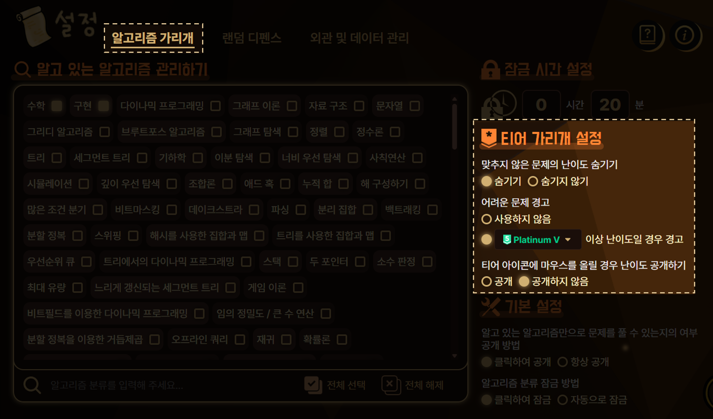

**티어 가리개**는 풀지 않은 문제의 난이도를 가리면서도, 사용자가 해결하기 어려운 난이도의 문제인지를 알 수 있는 기능입니다. 난이도 스포일러는 당하지 않으면서 연습에 부적합할 정도로 어려운 문제들을 피하고 싶을 때 유용할 것입니다.

티어 가리개가 제공하는 기능은 솔브드의 **어려운 문제 경고** 기능과 같습니다. 다만 토탐정을 이용한다면 백준에서도 기능을 사용할 수 있는 것이죠.

## 설정 방법

티어 가리개는 설정 페이지의 **[알고리즘 가리개]** - **[티어 가리개 설정]** 메뉴에서 설정하실 수 있습니다.

- **맞추지 않은 문제의 난이도 숨기기**: 티어 가리개를 사용할지를 설정할 수 있습니다. 사용 시 백준 내 모든 페이지에서 난이도가 숨겨지며 회색 별 아이콘으로 보여지게 됩니다. 단, 이미 푼 문제, 난이도가 Unrated / Not Ratable인 문제는 난이도가 가려지지 않습니다.
- **어려운 문제 경고**: 사용하고 난이도를 고르면, 그 난이도 이상의 문제가 등장할 경우 티어 아이콘이 붉은 느낌표의 아이콘으로 보이게 되어 어려운 문제임을 알 수 있습니다. 사용하지 않을 경우 난이도와 상관없이 회색 별 아이콘으로 보여집니다.
- **티어 아이콘에 마우스를 올릴 경우 난이도 공개하기**: 공개를 선택할 경우 티어 아이콘 위에 마우스를 올리면 숨겨졌던 난이도가 공개됩니다. 마우스가 티어 아이콘을 벗어나면 난이도는 다시 가려집니다.

티어 가리개는 설정 페이지에서만 활성화할 수 있으며 티어 가리개를 사용하도록 설정되어 있을 경우 백준 페이지 내에서 자동으로 적용됩니다.

### 솔브드와 어려운 문제에 대한 경고를 받는 난이도 일치시키기

솔브드에서 **어려운 문제 경고** 문제를 판단하는 기준은 아래와 같으니, 솔브드에서의 기준과 통일하고 싶으신 경우 참고하시기 바랍니다.

- 사용자의 티어가 Silver IV 이하인 경우 Bronze I 난이도부터 **어려운 문제 경고**의 대상이 됩니다.
- 그렇지 않을 경우 유저의 티어보다 두 단계 낮은 난이도부터 **어려운 문제 경고**의 대상이 됩니다.
