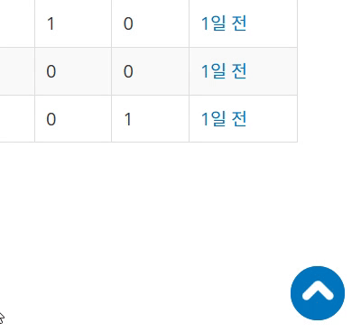
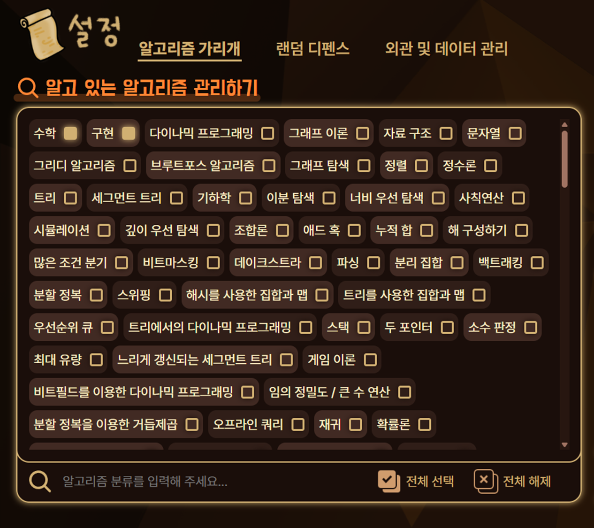
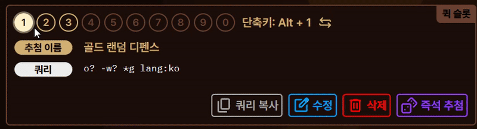
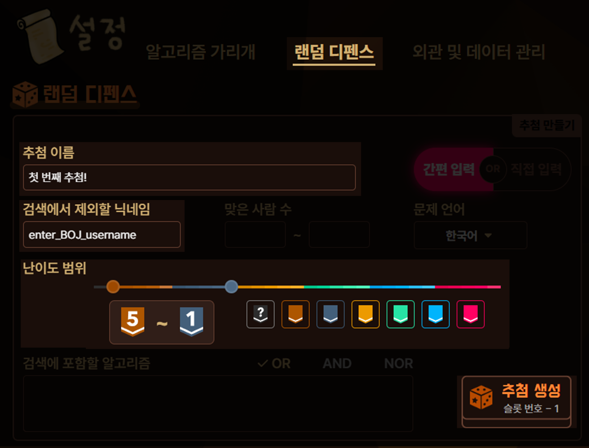
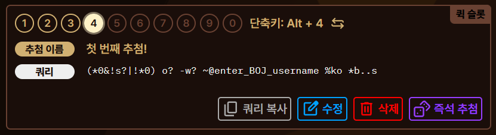

쉽고 빠르게 토탐정의 기능들을 몇 개 사용해 봅시다!

## 필요한 초기 설정

토탐정의 기능들을 이용하기 위해서는 몇몇 초기 설정이 필요합니다. 먼저, 백준의 [설정 페이지](https://www.acmicpc.net/modify)에 접속해 주세요.

그 다음, 아래의 두 설정을 변경해주세요.

- [보기] 카테고리에서, [솔브드 티어]를 **보기**로 설정해 주세요.
- [보기] 카테고리에서, [알고리즘 분류]를 **성공인 경우만 보기**로 설정해 주세요.

하단의 **변경** 버튼을 클릭해야 설정이 저장되므로, 잊지 마세요!

## 토탐정 위젯을 이용해 설정 페이지 들어가기

토탐정이 정상적으로 설치되었다면 백준 또는 솔브드 사이트에 접속 시 우측 하단에 TOP 버튼과 비슷하게 생긴 버튼이 보이실 겁니다. 이것이 바로 **토탐정 위젯**입니다. 토탐정 위젯을 이용해 토탐정의 여러 기능들을 간편하게 이용하실 수 있습니다.

우선은 이 위젯을 **우클릭**한 후 맨 위의 톱니바퀴 버튼을 눌러봅시다. 이렇게 하면 토탐정의 설정 페이지로 이동하실 수 있습니다. 설정 페이지에서 토탐정의 기능을 어떻게 사용할지를 설정하시게 됩니다.

## 알고리즘 가리개 사용해보기

**알고리즘 가리개**란 알고리즘 분류를 공개하지 않고도 알고 있는 알고리즘만으로 풀 수 있는지를 알려주는 기능입니다. 또한 알고리즘 분류를 보지 못하도록 일정 시간 잠글 수 있습니다.

이번에는 풀지 않은 문제 중 하나를 골라 그 문제를 알고 있는 알고리즘만으로 풀 수 있는 문제인지 확인해 봅시다.

### 알고 있는 알고리즘 관리하기

토탐정 설정에 들어가시면, 여러 알고리즘들이 나열되어 있는 아래의 메뉴를 찾으실 수 있습니다. 이 메뉴가 **알고 있는 알고리즘 관리하기** 메뉴입니다. 이 메뉴에서 알고 계신 알고리즘을 모두 체크해 주세요. 필요 시 하단의 검색창을 이용하실 수 있으며, 검색창에는 한글/영문 알고리즘명 및 태그, 별명을 입력하실 수 있습니다.

### 알고 있는 알고리즘만으로 풀 수 있는지 확인하기

이제 백준에서 여러분이 풀지 않은 아무 문제 페이지로 이동해 보신 후, 토탐정 위젯을 우클릭한 후 돋보기 버튼을 클릭해 결과를 확인할 수 있습니다! 이 기능을 **문제 조사**라고 합니다. 사용자님이 알고 있는 알고리즘으로 풀 수 있는지의 여부에 따라 "**이 문제는 알고 있는 알고리즘만으로 풀 수 있습니다.**" 또는 "**이 문제를 풀기 위해서는 모르는 알고리즘을 사용해야 할 수 있습니다.**" 가 결과로 나옵니다.

몇몇 상황에서는 버튼이 비활성화되며 **문제 조사** 기능을 사용할 수 없는데, 이 조건에 대해서는 [알고리즘 가리개](../features/algorithm-hider/) 페이지의 [알고리즘 가리개가 작동하지 않는 경우](../features/algorithm-hider/#알고리즘-가리개가-작동하지-않는-경우) 문단을 참고해 주시기 바랍니다.

## 랜덤 디펜스 진행해보기

**랜덤 디펜스**란 무작위로 제시되는 알고리즘 문제를 푸는 연습 방식입니다. 문제를 추첨해봅시다.

토탐정 설정에 들어가신 후 **랜덤 디펜스** 카테고리를 골라주세요. 여기에서 설정을 진행할 것입니다.

### 슬롯 번호 고르기

추첨을 만들기 전, 먼저 우리는 **슬롯 번호**를 고를 것입니다. 이미지를 참고하여, 하단의 **퀵 슬롯** 메뉴에서 슬롯 번호를 선택해주세요. 슬롯 번호를 선택하시면 그 슬롯에 어떤 추첨이 저장되어 있는지 확인하실 수 있으며, 이후 추첨을 만드실 때 그 번호의 슬롯에 추첨이 저장되게 됩니다.

1~3번 슬롯에는 여러분이 바로 랜덤 디펜스를 이용하실 수 있도록 제가 추첨을 만들어 두었습니다. 여기에서는 4번 슬롯에 추첨을 만들어보겠습니다.

### 추첨 만들기

슬롯을 고르셨다면 이제 상단의 추첨 만들기 메뉴에서, 추첨 이름, 검색에서 제외할 닉네임, 난이도 범위를 적절히 정한 후 **추첨 생성** 버튼을 눌러 추첨을 만들어 봅시다.

- **검색에서 제외할 닉네임**에는 사용자님의 백준 핸들(아이디)을 적으시면 됩니다. 해당 핸들에서 푼 문제들은 제외되어 문제가 추첨될 것입니다.

방금의 작업으로 첫 추첨을 만드셨으며, 만드신 추첨은 슬롯에 저장되었습니다. 아래의 **퀵 슬롯** 메뉴를 다시 보시면 만드신 추첨이 잘 반영되었음을 확인하실 수 있을 것입니다.

### 문제 추첨하기

#### 한 문제를 추첨하는 경우

백준 또는 솔브드에 접속하신 후, **퀵 슬롯**에 적혀있던 단축키를 누르면 바로 문제가 추첨되며, 추첨된 문제 페이지로 이동하게 됩니다. 키보드를 사용하기 어려우시다면, 토탐정 위젯을 우클릭한 후 주사위 버튼을 클릭하는 것으로도 문제 추첨이 가능합니다.

#### 여러 문제를 추첨하는 경우

한 문제를 추첨할 때와 비슷합니다. 이번에는 단축키를 길게 눌러보세요. 주사위 버튼을 클릭하는 방법을 사용하시는 경우 마우스를 길게 누르고 있어보세요. 바로 문제가 추첨되는 대신, 추첨할 문제 수를 입력할 수 있게 됩니다.

추첨할 문제 수를 입력하면 여러 문제를 한꺼번에 추첨할 수 있는 **즉석 추첨** 기능을 이용하실 수 있게 되며, 카드팩을 누르면 여러 문제가 한꺼번에 추첨됩니다.

## 마치며

이것으로 토탐정의 핵심 기능들을 이용해 보았습니다. 보다 자세하게 설정을 하고 싶으시다면 본 문서의 기능 카테고리에 있는 글들도 확인해보세요. 즐거운 문제해결 되세요!
